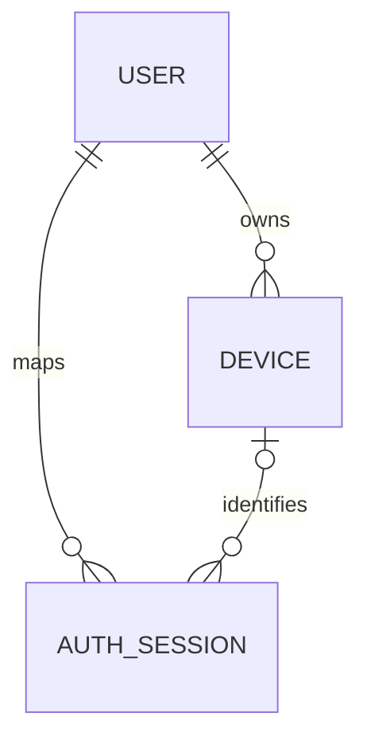

# Phase 1 identity and authentication architecture

## Boundary

Supabase Auth is the authentication authority. The backend verifies Supabase access tokens and maps
verified identities to operational PostgreSQL records. It never accepts client-supplied ownership,
stores passwords, emits alternative access tokens, or decides permissions.

Authentication answers who the user is, which observed session is active, and which owned device is
associated with the request. Authorization remains Phase 2.

## Request flow

1. FastAPI extracts a bearer token without logging it.
2. The JWT verifier restricts algorithms to `ES256` and `RS256`, locates the public key through
   cached JWKS discovery, and validates signature, issuer, audience, expiry, type, role, and required
   claims.
3. The identity service provisions or loads the internal user by unique `auth_user_id`.
4. If Supabase supplies `session_id`, the backend idempotently observes that session. Missing
   session identifiers are left absent.
5. An optional `X-Device-ID` is accepted only if it belongs to the authenticated user and is not
   revoked. A session already mapped to a device cannot be switched to another device.
6. An immutable `IdentityContext` is returned. It carries no permissions or roles.

JWKS sets are cached for a configurable TTL, defaulting to 10 minutes. PyJWT refreshes once when a
`kid` is missing, supporting key rotation. Network failures reject authentication safely with a
503 response; tokens are never accepted without verification.

## Data model

| Entity | Ownership and purpose | Important constraints |
|---|---|---|
| User | Internal profile mapped to Supabase `sub` | UUID PK; unique non-null `auth_user_id`; ACTIVE/DISABLED |
| Device | Known installation owned by one user | UUID PK; unique `(user_id, device_identifier)`; restrictive user FK |
| AuthSession | Observed Supabase session | UUID PK; unique Supabase session identifier; user FK; nullable device FK |

User and device deletion is not exposed. User foreign keys use `RESTRICT` to avoid destructive
cascades. Removing a device record would set its historical session relationship to null, while
normal revocation retains the record and revokes mapped internal sessions.

All application timestamps are aware UTC values and PostgreSQL columns use timezone-aware
timestamps. SQLite is used only for isolated tests.

## Device identity

`device_identifier` represents a stable installation identifier, not a secret or proof of device
authenticity. The server-generated device UUID becomes the request handle. Public keys may be stored
for a future approved challenge mechanism; private keys are rejected. Capability manifests are
boolean maps limited by key count, key syntax, and encoded size.

## MFA readiness

The verified Supabase `aal` claim maps to `AAL1`, `AAL2`, or `UNKNOWN`. Phase 1 never invents
`AAL2`. Supabase MFA and future step-up requirements remain external/future policy concerns.

## Loading and external services

Database engines and JWKS clients are created lazily. Importing the ASGI app performs no database or
network connection. No Supabase SDK, service-role operation, Sentry exporter, or OpenTelemetry
collector is initialized.
