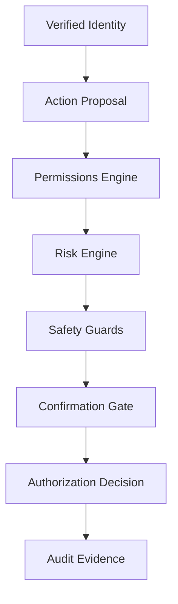

# Permissions, Risk, Confirmation, and Audit Architecture

## Boundary

Phase 2 turns a verified Phase 1 identity and an untrusted action proposal into an immutable
authorization decision. It contains no executor and cannot call an external integration.

The proposal may come from a future LLM, UI, device, or system component. None is authoritative.
Only the server pipeline can produce `ALLOW`, `DENY`, or `REQUIRE_CONFIRMATION`.

## Evaluation order

1. Revalidate the internal user mapping and active state.
2. Resolve an enabled server-owned capability.
3. Reject any action outside that capability's server-owned action vocabulary.
4. Find an explicit permission; no record means deny.
5. Observe revocation and runtime expiry.
6. Match resource type, operations, resource IDs, and optional device scope.
7. Compute deterministic risk from the capability catalog.
8. Apply the non-overridable financial execution guard.
9. Apply confirmation policy and validate any action-bound approval.
10. Persist the immutable decision and required audit events.

Database, risk, guard, confirmation, or required-audit failure cannot produce `ALLOW`.

## Persistence

- `capabilities`: global server-owned catalog with valid actions, kill switch, and risk attributes.
- `permissions`: user, capability, structured scope, optional device, lifecycle, confirmation
  policy, grant source, and last use.
- `authorization_decisions`: immutable snapshots used to bind confirmation to one evaluation.
- `confirmation_requests`: user/action/scope-bound approvals with expiry and consumption state.
- `audit_events`: append-oriented evidence; no normal update or delete API exists.

All new internal identifiers are UUIDs. Foreign keys use restrictive or evidence-preserving
deletion behavior; Phase 1 tables and identity semantics are not rebuilt or weakened.

## Bootstrap boundary

An authenticated AAL2 user may administer only their own permissions through a dedicated
account-control service. The route does not invoke the general Permissions Engine, avoiding a
self-authorizing cycle. Ownership, capability existence, optional device ownership, expiration,
grant source, and audit evidence are server-controlled. The body cannot contain `user_id` or
grant-source authority. This is not an `admin` role or universal bootstrap permission.

## Capability/action authority

`Capability.allowed_actions` is the single runtime source of truth for the valid action
vocabulary. A grant is rejected unless every requested operation is in that list. Authorization
repeats the check before permission lookup and risk classification, and also rejects a malformed
legacy permission whose stored operations exceed the capability vocabulary.

Permission scope can only narrow a capability's server-defined authority; it cannot create an
action that the capability does not own. The financial guard remains an additional independent
restriction after capability/action validation.

## Deferred

Task Engine, executor, queues, workers, integrations, LLMs, production deployment, and actual
side effects remain outside Phase 2.
